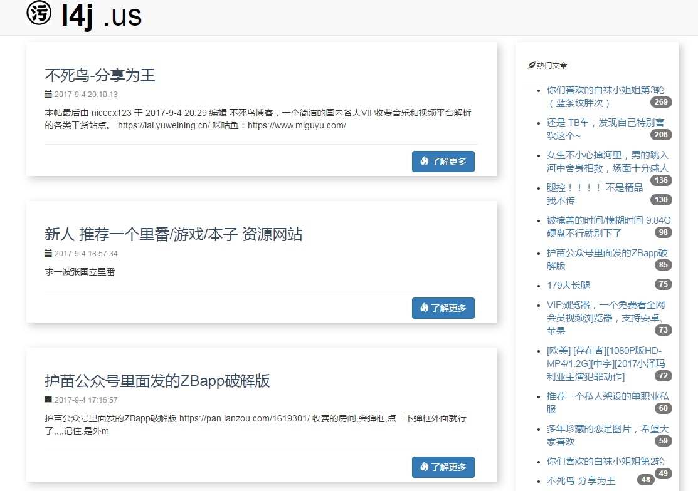
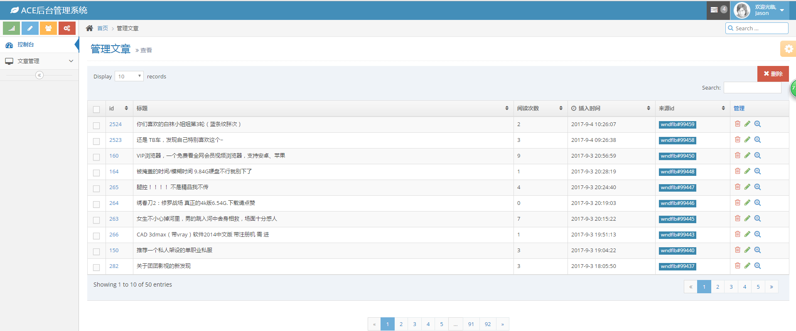

## BBB~ 老司机开车了！
------
网站基于Python Flask开发
1. 前端模板出处：http://ihowandwhy.com
2. 后台模板出处：http://www.daimajiayuan.com/preview/18152.html

示例网站：http://l47.me

前端：

后台：

---

# 安装教程：

> ps. 推荐安装环境：Centos7
```
git clone http://github.com/tanrela/l4j_blog # 克隆代码
cd l4j_blog # 切换目录
pip install -r  requirement.txt # 安装依赖
```
以上，应该安装好了python依赖包。

接下来是初始化数据：

0. 在根目录创建一个`logs`文件夹：`mkdir logs`
1. 首先你应该创建了一个mysql数据库（utf-8格式）,然后修改`config.py`里面的`user`、`passwd`、`db`
2. 初始化数据库：`python run.py init_data`
3. 创建管理员账号：`python run.py insert_admin`，按提示输入管理员账号、密码、邮箱

运行：`gunicorn -w4 -b 0.0.0.0:8888 run:app`

然后访问 ip:8888 试试？

更多配置，请参考：http://github.com/tangrela/tumblr_crawler

> ps:http://l47.me 里面的文章采集自：1）万能的福利吧（过气论坛）; 2）1024-技术讨论区

> 本项目不包含爬虫。如需定制爬虫请联系：video4sexroot@gmail.com
